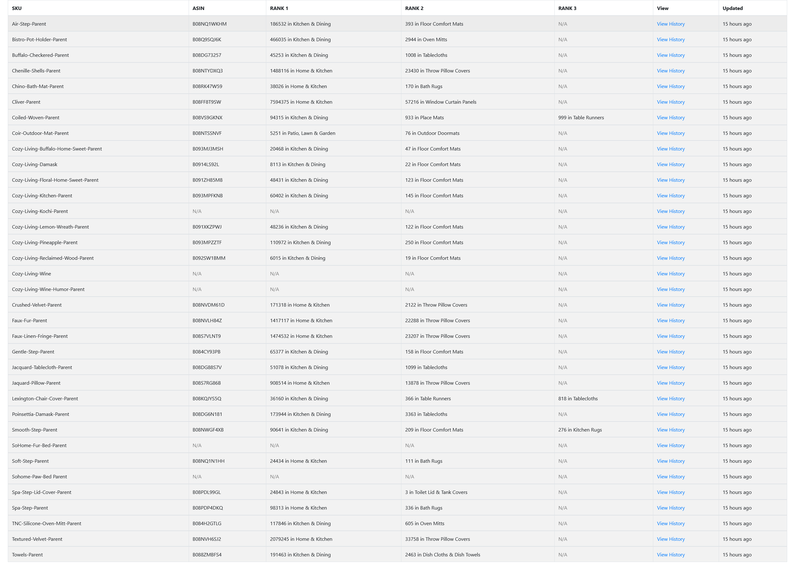
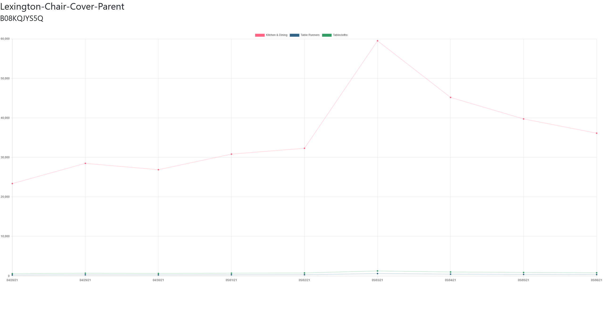

<!--
*** Thanks for checking out the Best-README-Template. If you have a suggestion
*** that would make this better, please fork the repo and create a pull request
*** or simply open an issue with the tag "enhancement".
*** Thanks again! Now go create something AMAZING! :D
***
***
***
*** To avoid retyping too much info. Do a search and replace for the following:
*** ariel-nathan, Amazon-Ranking-Tracker, twitter_handle, nathanariel17@gmail.com, Amazon Ranking Tracker, A Fullstack Web App that allows the user to specify Amazon Parent ASINs on the backend and then track the ranking of the ASINs automatically everyday at 12am. The app then displays the rankings for each parent ASIN as well as generates a graph to visualize the ranking history.
-->

<!-- PROJECT SHIELDS -->
<!--
*** I'm using markdown "reference style" links for readability.
*** Reference links are enclosed in brackets [ ] instead of parentheses ( ).
*** See the bottom of this document for the declaration of the reference variables
*** for contributors-url, forks-url, etc. This is an optional, concise syntax you may use.
*** https://www.markdownguide.org/basic-syntax/#reference-style-links
-->

![lastcommit-shield]
[![MIT License][license-shield]][license-url]
[![LinkedIn][linkedin-shield]][linkedin-url]

<!-- PROJECT LOGO -->
<br />
<p align="center">
  <a href="https://github.com/ariel-nathan/Amazon-Ranking-Tracker">
    
  </a>

  <h3 align="center">Amazon Ranking Tracker</h3>

  <p align="center">
    A Fullstack Web App that allows the user to specify Amazon Parent ASINs on the backend and then track the ranking of the ASINs automatically everyday at 12am. The app then displays the rankings for each parent ASIN as well as generates a graph to visualize the ranking history.
    <br />
    <a href="https://github.com/ariel-nathan/Amazon-Ranking-Tracker"><strong>Explore the docs »</strong></a>
    <br />
    <br />
    <a href="https://amazon-rankings.netlify.app/">View Live</a>
    ·
    <a href="https://github.com/ariel-nathan/Amazon-Ranking-Tracker/issues">Report Bug</a>
    ·
    <a href="https://github.com/ariel-nathan/Amazon-Ranking-Tracker/issues">Request Feature</a>
  </p>
</p>

<!-- TABLE OF CONTENTS -->
<details open="open">
  <summary><h2 style="display: inline-block">Table of Contents</h2></summary>
  <ol>
    <li>
      <a href="#about-the-project">About The Project</a>
      <ul>
        <li><a href="#built-with">Built With</a></li>
      </ul>
    </li>
    <li>
      <a href="#getting-started">Getting Started</a>
      <ul>
        <li><a href="#prerequisites">Prerequisites</a></li>
        <li><a href="#installation">Installation</a></li>
      </ul>
    </li>
    <li><a href="#contributing">Contributing</a></li>
    <li><a href="#license">License</a></li>
    <li><a href="#contact">Contact</a></li>
  </ol>
</details>

<!-- ABOUT THE PROJECT -->

## About The Project




### Built With

- [React](https://reactjs.org/)
- [Node](https://nodejs.org/en/)
- [Express](https://expressjs.com/)
- [Axios](https://github.com/axios/axios)
- [node-cron](https://github.com/node-cron/node-cron)
- [mongoose](https://mongoosejs.com/)
- [MongoDB](https://www.mongodb.com/)
- [dotenv](https://github.com/motdotla/dotenv)
- [neat-csv](https://github.com/sindresorhus/neat-csv)
- [moment](https://momentjs.com/)
- [cors](https://github.com/expressjs/cors)
- [cheerio](https://cheerio.js.org/)

<!-- GETTING STARTED -->

## Getting Started

To get a local copy up and running follow these simple steps.

### Prerequisites

-node

### Installation

1. Clone the repo
   ```sh
   git clone https://github.com/ariel-nathan/React-Memories.git
   ```
2. Install server NPM packages
   ```sh
   cd server
   npm install
   ```
3. Install client NPM packages
   ```sh
   cd client
   npm install
   ```
4. Fill .env.example
   ```sh
   CONNECTION_URL = "MONGODB_URL_STRING"
   ```
5. Start the server
   ```sh
   cd server
   npm start
   ```
6. Run the client
   ```sh
   cd client
   npm start
   ```

<!-- CONTRIBUTING -->

## Contributing

Contributions are what make the open source community such an amazing place to be learn, inspire, and create. Any contributions you make are **greatly appreciated**.

1. Fork the Project
2. Create your Feature Branch (`git checkout -b feature/AmazingFeature`)
3. Commit your Changes (`git commit -m 'Add some AmazingFeature'`)
4. Push to the Branch (`git push origin feature/AmazingFeature`)
5. Open a Pull Request

<!-- LICENSE -->

## License

Distributed under the MIT License. See `LICENSE` for more information.

<!-- CONTACT -->

## Contact

Ariel Nathan - me@arielnathan.com

Project Link: [https://github.com/ariel-nathan/Amazon-Ranking-Tracker](https://github.com/ariel-nathan/Amazon-Ranking-Tracker)

<!-- MARKDOWN LINKS & IMAGES -->
<!-- https://www.markdownguide.org/basic-syntax/#reference-style-links -->

[lastcommit-shield]: https://img.shields.io/github/last-commit/ariel-nathan/Amazon-Ranking-Tracker/main?style=flat-square
[license-shield]: https://img.shields.io/github/license/ariel-nathan/Amazon-Ranking-Tracker?style=flat-square
[license-url]: https://github.com/ariel-nathan/repo/blob/master/LICENSE.txt
[linkedin-shield]: https://img.shields.io/badge/-LinkedIn-black.svg?style=flat-square&logo=linkedin&colorB=555
[linkedin-url]: https://linkedin.com/in/ariel-nathan
